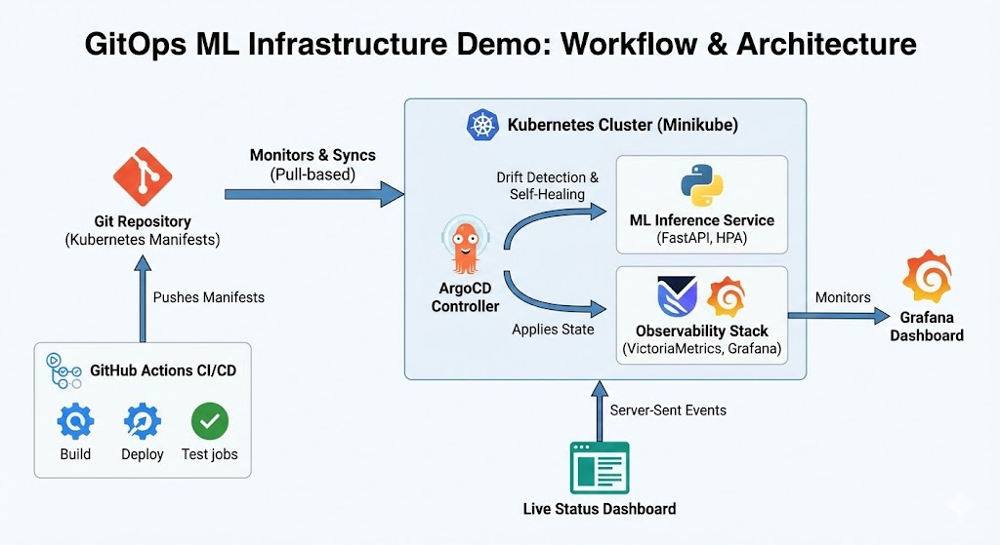

# GitOps ML Infrastructure Demo

[](https://argoproj.github.io/cd/)
[](https://kubernetes.io/)
[](https://victoriametrics.com/)
[](https://grafana.com/)
[](https://python.org/)

**Live Status:**</br>
[](https://gitops.neevs.io)
[](https://gitops.neevs.io)
[](https://gitops.neevs.io)
[](https://gitops.neevs.io)

**ML infrastructure implementing GitOps practices with ArgoCD, Kubernetes, and automated CI/CD pipelines.**

Built entirely on GitHub Actions free tier, this project demonstrates modern infrastructure patterns including declarative deployments, self-healing systems, and real-time observability.

## Overview

- **GitOps Deployment**: ArgoCD continuously syncs Kubernetes manifests from Git
- **Automated CI/CD**: Parallelized GitHub Actions workflows
- **ML Inference Service**: FastAPI sentiment analysis API with metrics
- **Observability**: VictoriaMetrics + Grafana monitoring stack
- **Live Dashboard**: Real-time deployment tracking via Server-Sent Events
- **Self-Healing**: Automatic drift detection and correction

## Architecture



## Quick Start

**GitHub Actions (Recommended):**
1. Go to [Actions tab](../../actions/workflows/gitops-demo.yml)
2. Click "Run workflow"
3. Monitor the deployment (~10 min)

**Local:** See [Deployment Guide](docs/DEPLOYMENT.md)

## Project Structure

```
.
├── .github/workflows/
│   ├── gitops-demo.yml              # Main GitOps workflow
│   ├── live-server.yml              # Public hosting via Cloudflare
│   └── debug-ssh-access.yml         # SSH debugging
│
├── app/ml-inference/
│   ├── app.py                       # FastAPI service
│   └── Dockerfile
│
├── k8s/
│   ├── inference-service/           # ML service manifests
│   └── observability/               # Monitoring stack
│
├── scripts/
│   └── dashboard_server.py          # Live dashboard server
│
└── docs/                            # Documentation
```

## Key Features

### GitOps Workflow
Pull-based deployment model where ArgoCD monitors Git and syncs changes automatically, providing complete audit trails and easy rollbacks.

### Self-Healing
Automatic drift detection and correction when cluster state diverges from Git-declared manifests.

### Production Patterns
- Health probes (liveness, readiness, startup)
- Horizontal Pod Autoscaler
- Resource constraints
- Prometheus-compatible metrics

## Technologies

| Category | Technology |
|----------|------------|
| GitOps | ArgoCD |
| Orchestration | Kubernetes (Minikube) |
| CI/CD | GitHub Actions |
| ML Service | FastAPI, Python |
| Monitoring | VictoriaMetrics, Grafana |
| Registry | GitHub Container Registry |

## Documentation

- **[API Reference](docs/API.md)** - ML inference endpoints and examples
- **[Deployment Guide](docs/DEPLOYMENT.md)** - Local and CI/CD setup
- **[Workflow Architecture](docs/WORKFLOW-ARCHITECTURE.md)** - CI/CD pipeline design
- **[Live Server](docs/LIVE-SERVER.md)** - Public hosting via Cloudflare Tunnel
- **[Modular Infrastructure](docs/MODULAR-INFRASTRUCTURE.md)** - Distributed architecture patterns
- **[Debug Workflow](docs/DEBUG-WORKFLOW.md)** - SSH-based debugging

## License

MIT License - see [LICENSE](LICENSE)
