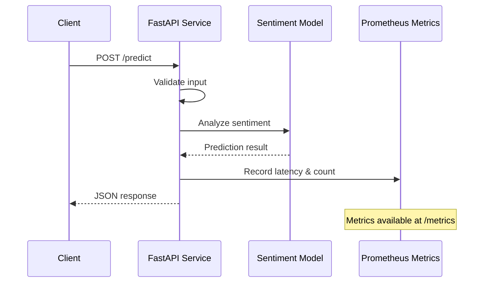

# ML Inference API Reference

FastAPI-based sentiment analysis service with Prometheus-compatible metrics.

## Request Flow



## Endpoints

### Health & Readiness

| Endpoint | Method | Description |
|----------|--------|-------------|
| `/health` | GET | Liveness probe for Kubernetes |
| `/ready` | GET | Readiness probe for traffic routing |

### Inference

#### Single Prediction

```http
POST /predict
Content-Type: application/json

{"text": "This GitOps demo is amazing!"}
```

**Response:**
```json
{
  "text": "This GitOps demo is amazing!",
  "sentiment": "positive",
  "confidence": 0.85,
  "processing_time_ms": 12.34,
  "timestamp": "2024-01-15T10:30:00.000Z"
}
```

#### Batch Prediction

```http
POST /predict/batch
Content-Type: application/json

{"texts": ["Great product!", "Terrible experience", "It's okay"]}
```

**Response:**
```json
{
  "predictions": [
    {"text": "Great product!", "sentiment": "positive", "confidence": 0.7, ...},
    {"text": "Terrible experience", "sentiment": "negative", "confidence": 0.7, ...},
    {"text": "It's okay", "sentiment": "neutral", "confidence": 0.52, ...}
  ],
  "total_processing_time_ms": 45.67
}
```

### Metrics

```http
GET /metrics
```

Returns Prometheus-compatible metrics in OpenMetrics format:

| Metric | Type | Description |
|--------|------|-------------|
| `inference_requests_total` | Counter | Request count by endpoint and status |
| `inference_request_duration_seconds` | Histogram | Request latency distribution |
| `model_inference_duration_seconds` | Histogram | Model inference time |
| `inference_active_requests` | Gauge | Current concurrent requests |

**Example output:**
```
# HELP inference_requests_total Total number of inference requests
# TYPE inference_requests_total counter
inference_requests_total{endpoint="/predict",status="200"} 1234

# HELP inference_request_duration_seconds Request processing time
# TYPE inference_request_duration_seconds histogram
inference_request_duration_seconds_bucket{le="0.01"} 100
inference_request_duration_seconds_bucket{le="0.05"} 450
```

## Usage Examples

### curl

```bash
# Single prediction
curl -X POST http://localhost:8000/predict \
  -H "Content-Type: application/json" \
  -d '{"text": "This is amazing!"}'

# Batch prediction
curl -X POST http://localhost:8000/predict/batch \
  -H "Content-Type: application/json" \
  -d '{"texts": ["Good", "Bad", "Neutral"]}'

# Health check
curl http://localhost:8000/health
```

### Python

```python
import requests

response = requests.post(
    "http://localhost:8000/predict",
    json={"text": "This product is excellent!"}
)
print(response.json())
```

## Constraints

| Constraint | Value |
|------------|-------|
| Single text length | 1-500 characters |
| Batch size | 1-20 texts per request |
| Rate limit | None (controlled by HPA) |

## Error Responses

```json
{
  "detail": "Text must be between 1 and 500 characters"
}
```

Status codes:
- `200` - Success
- `400` - Invalid input (validation error)
- `422` - Unprocessable entity (malformed JSON)
- `500` - Internal server error
