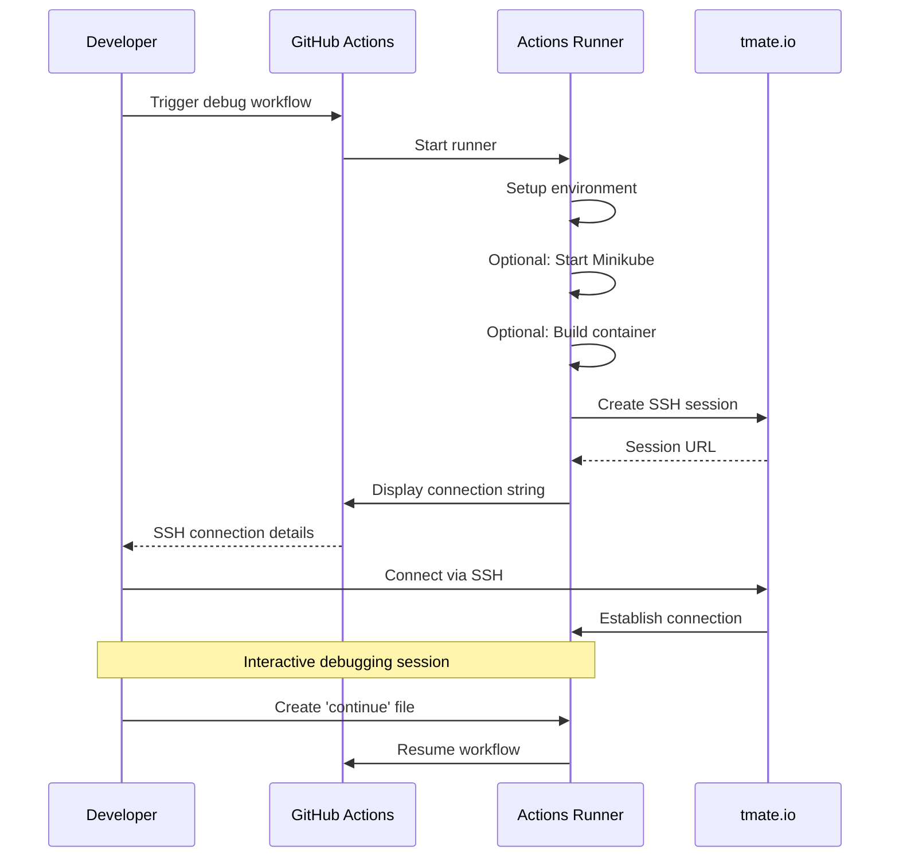

# Debug SSH Access

SSH into a GitHub Actions runner for interactive debugging via tmate.

## Workflow Overview



## Quick Start

1. Go to **Actions** > **Debug SSH Access**
2. Click **Run workflow**
3. Configure options:
   - Enable tmate session (default: on)
   - Setup Minikube cluster (default: on)
   - Build Docker container (default: off)
4. Find connection string in logs:
   ```
   SSH: ssh ABC123@nyc1.tmate.io
   Web: https://tmate.io/t/ABC123
   ```

## Common Tasks

### Explore Cluster
```bash
# Check cluster status
kubectl cluster-info
kubectl get nodes

# View all pods
kubectl get pods -A

# Check resource usage
kubectl top nodes
kubectl top pods -A
```

### Debug Deployments
```bash
# Describe deployment
kubectl describe deployment ml-inference -n ml-inference

# View logs
kubectl logs -f deployment/ml-inference -n ml-inference

# Check events
kubectl get events -n ml-inference --sort-by='.lastTimestamp'

# Check pod status
kubectl get pods -n ml-inference -o wide
```

### Test ArgoCD
```bash
# Install ArgoCD
kubectl create namespace argocd
kubectl apply -n argocd -f https://raw.githubusercontent.com/argoproj/argo-cd/stable/manifests/install.yaml
kubectl wait --for=condition=available deployment/argocd-server -n argocd --timeout=300s

# Get admin password
kubectl -n argocd get secret argocd-initial-admin-secret -o jsonpath="{.data.password}" | base64 -d

# Port-forward to access UI
kubectl port-forward svc/argocd-server -n argocd 8080:443
```

### Test ML API
```bash
# Health check
curl http://localhost:8000/health

# Test prediction
curl -X POST http://localhost:8000/predict \
  -H "Content-Type: application/json" \
  -d '{"text": "This is amazing!"}'

# Check metrics
curl http://localhost:8000/metrics
```

## Session Management

### Exit Session

Create a file to continue the workflow:
```bash
touch continue
```

The workflow will resume and complete normally.

### Timeouts

| Setting | Duration |
|---------|----------|
| Default timeout | 20 minutes |
| Maximum timeout | 30 minutes |
| Auto-disconnect | After timeout |

## Troubleshooting

| Issue | Solution |
|-------|----------|
| Permission denied | Ensure SSH keys are registered with GitHub account |
| Session not found | Session expired - re-run workflow |
| Container not starting | Check `docker logs ml-inference` and `free -h` |
| Minikube won't start | Check `minikube logs` and available resources |
| Connection dropped | Session timeout reached - re-run workflow |

## Security Notes

- Debug sessions are ephemeral and destroyed after workflow completion
- Sessions require SSH key authentication (no passwords)
- All actions are logged in GitHub Actions
- Sessions expire automatically after timeout
- Only accessible to repository collaborators
