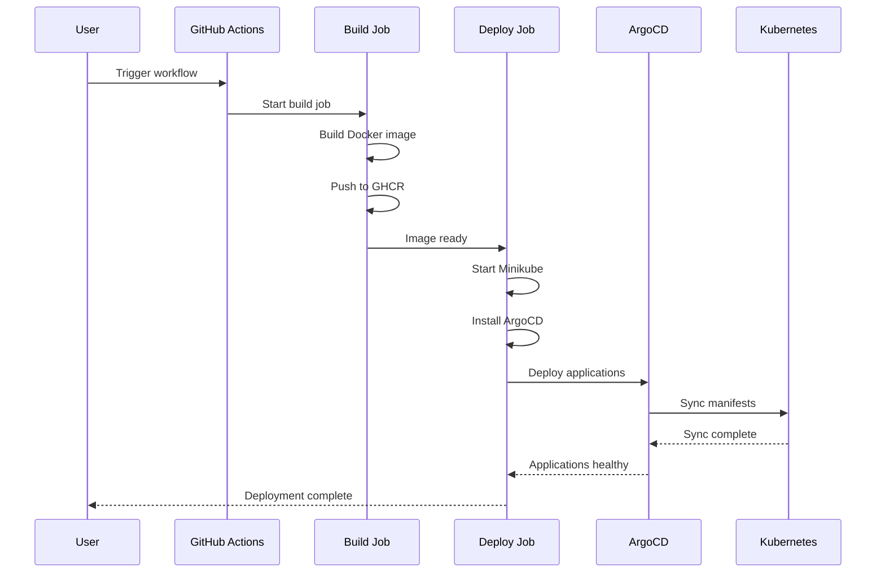
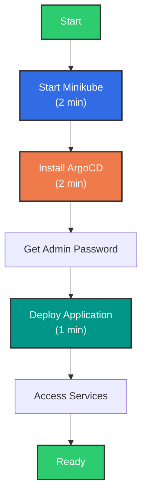

# Deployment Guide

## GitHub Actions (Recommended)

The primary workflow runs the complete infrastructure stack with zero setup.

### Deployment Flow



### Steps

1. Navigate to the [Actions tab](../../actions/workflows/gitops-demo.yml)
2. Select "GitOps Infrastructure Demo"
3. Click "Run workflow"
4. Monitor the parallelized jobs
5. Download artifacts for deployment reports

**Duration:** ~10 minutes | **Cost:** $0 (free tier)

## Local Deployment

### Prerequisites

| Tool | Purpose | Required |
|------|---------|----------|
| Docker | Container runtime | Yes |
| kubectl | Kubernetes CLI | Yes |
| Minikube | Local Kubernetes | Yes |
| ArgoCD CLI | GitOps management | Optional |

### Local Deployment Flow



### Quick Start

```bash
# 1. Start cluster
minikube start --cpus=2 --memory=4096 --kubernetes-version=v1.28.0

# 2. Install ArgoCD
kubectl create namespace argocd
kubectl apply -n argocd -f https://raw.githubusercontent.com/argoproj/argo-cd/stable/manifests/install.yaml
kubectl wait --for=condition=ready pod -l app.kubernetes.io/name=argocd-server -n argocd --timeout=300s

# 3. Get admin password
kubectl -n argocd get secret argocd-initial-admin-secret -o jsonpath="{.data.password}" | base64 -d

# 4. Access UI
kubectl port-forward svc/argocd-server -n argocd 8080:443
# Open https://localhost:8080 (admin / password from step 3)

# 5. Deploy application
argocd app create ml-inference \
  --repo https://github.com/jonasneves/gitops-ml-infra-demo \
  --path k8s/inference-service \
  --dest-server https://kubernetes.default.svc \
  --dest-namespace ml-inference \
  --sync-policy automated
```

### Access Services

```bash
# ML Inference API
kubectl port-forward svc/ml-inference -n ml-inference 8000:80

# Grafana Dashboard
kubectl port-forward svc/grafana -n monitoring 3000:3000

# VictoriaMetrics
kubectl port-forward svc/victoriametrics -n monitoring 8428:8428
```

### Cleanup

```bash
minikube delete
```
