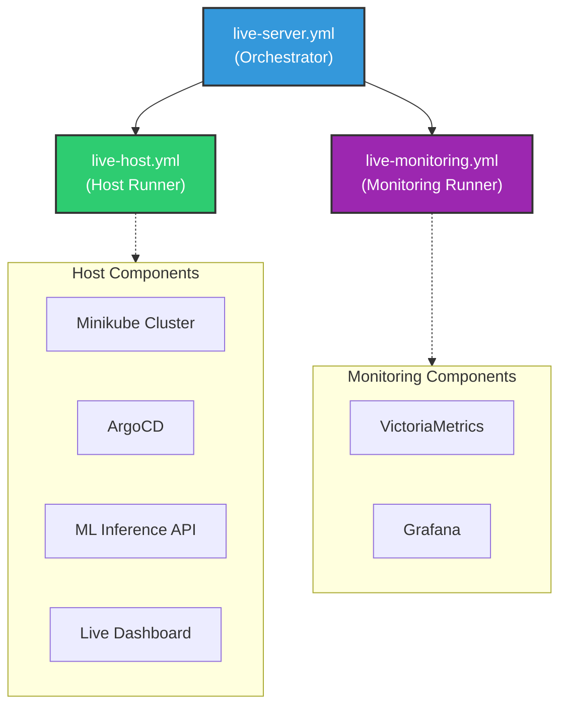
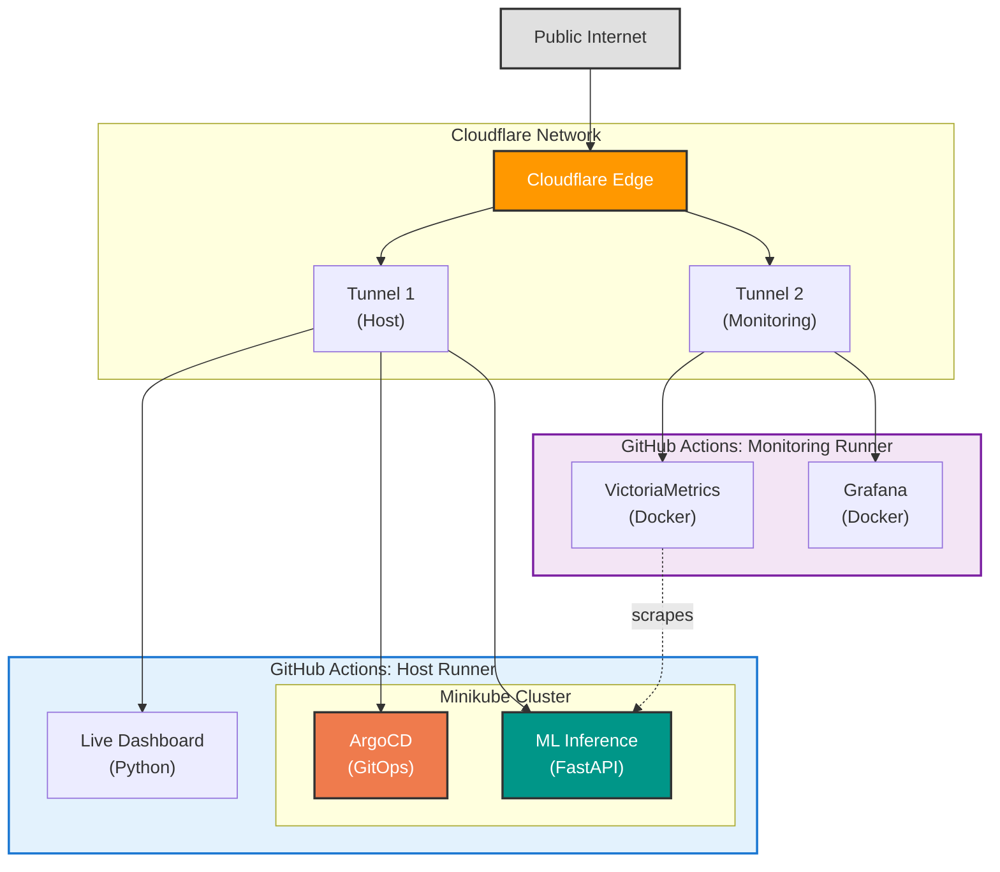
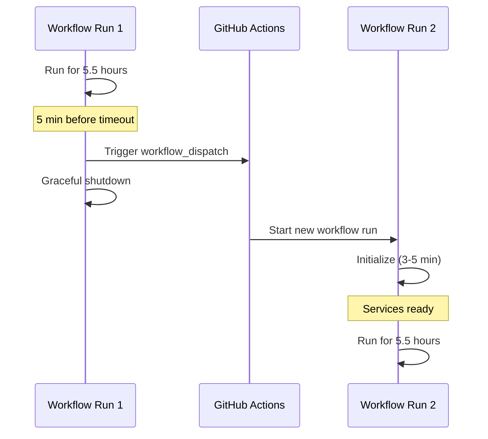

# Live Server Hosting

Host the complete GitOps infrastructure publicly using GitHub Actions and Cloudflare Tunnel.

## Overview

Modular workflow architecture with three workflow files:



Run everything together via `live-server.yml`, or run components independently for selective deployment.

## Prerequisites

1. Cloudflare account with a domain
2. GitHub repository secrets configured

## Setup

### 1. Create Cloudflare Tunnel

In Cloudflare Zero Trust dashboard:

1. Go to **Networks** > **Tunnels**
2. Click **Create a tunnel**
3. Name it (e.g., `gitops-ml-demo`)
4. Copy the tunnel token

### 2. Configure Public Hostnames

Create two tunnels - one for each runner:

**Main Tunnel (Host Runner):**

| Subdomain | Service | Type |
|-----------|---------|------|
| `gitops` | `http://localhost:8080` | HTTP |
| `argocd` | `https://localhost:8443` | HTTPS |
| `ml-api` | `http://localhost:8000` | HTTP |

**Monitoring Tunnel (Monitoring Runner):**

| Subdomain | Service | Type |
|-----------|---------|------|
| `grafana` | `http://localhost:3000` | HTTP |
| `metrics` | `http://localhost:8428` | HTTP |

**Note:** For ArgoCD, enable "No TLS Verify" in the tunnel settings since it uses a self-signed certificate.

### 3. Add GitHub Secrets

| Secret | Description |
|--------|-------------|
| `CLOUDFLARE_TUNNEL_TOKEN` | Token for host runner tunnel |
| `CLOUDFLARE_TUNNEL_TOKEN_MONITORING` | Token for monitoring runner tunnel (optional) |

## Architecture



## Services

**Host Runner:**

| Service | Port | Description |
|---------|------|-------------|
| Dashboard | 8080 | Real-time deployment monitoring |
| ArgoCD UI | 8443 | GitOps controller interface |
| ML API | 8000 | Sentiment analysis endpoints |

**Monitoring Runner:**

| Service | Port | Description |
|---------|------|-------------|
| Grafana | 3000 | Metrics visualization |
| VictoriaMetrics | 8428 | Prometheus-compatible TSDB |

## Usage

### Start via GitHub Actions UI

1. Go to Actions tab
2. Select "Live Server"
3. Click "Run workflow"
4. Configure duration and auto-restart
5. Check logs for ArgoCD password

### Start via CLI

```bash
# Default 5.5 hours with auto-restart
gh workflow run live-server.yml

# Custom duration
gh workflow run live-server.yml -f duration_hours=2

# Disable auto-restart
gh workflow run live-server.yml -f auto_restart=false

# With base domain (enables service discovery)
gh workflow run live-server.yml -f base_domain=yourdomain.com
```

The `base_domain` input enables convention-based service discovery:
- `ml-api.yourdomain.com`
- `grafana.yourdomain.com`
- `argocd.yourdomain.com`
- etc.

### Auto-trigger

The workflow starts when changes are pushed to:
- `app/ml-inference/**`
- `k8s/**`
- `scripts/dashboard_server.py`

## ArgoCD Access

The ArgoCD admin password is displayed in the workflow logs:

```
ArgoCD Credentials:
  Username: admin
  Password: <generated-password>
```

Features available:
- View application sync status
- Trigger manual syncs
- View Kubernetes resources
- Check application health
- View sync history

## Monitoring

Both runners output health status every 30 seconds:

**Host Runner:**
```
[14:32:15] ArgoCD: OK | API: OK | Dashboard: OK | Tunnel: OK | 45m/330m
```

**Monitoring Runner:**
```
[14:32:15] VictoriaMetrics: OK | Grafana: OK | 45m/330m
```

Services auto-restart if they go down.

## 6-Hour Timeout Handling

GitHub Actions has a 6-hour limit. The workflow handles this automatically:



**Note:** Brief downtime (~3-5 minutes) during transitions while Minikube and ArgoCD initialize.

## Grafana Dashboards

Default credentials:
- Username: `admin`
- Password: `admin`

Pre-configured data source: VictoriaMetrics

## Troubleshooting

### ArgoCD not accessible

Check the tunnel configuration has "No TLS Verify" enabled for the ArgoCD hostname (it uses self-signed certs).

### Applications not syncing

View ArgoCD logs:
```bash
kubectl logs -n argocd -l app.kubernetes.io/name=argocd-application-controller
```

### Port-forward keeps dying

The workflow auto-restarts failed port-forwards. Check the workflow logs for specific errors.

### Services slow to start

Initial setup takes ~5 minutes:
- Minikube start: ~2 min
- ArgoCD install: ~2 min
- App sync: ~1 min

## Limitations

- Not for production workloads
- ~5 minute cold start for host runner
- ArgoCD password changes on each restart
- Uses 2x GitHub Actions runner minutes (parallel jobs)
- Brief downtime during auto-restart rotation
