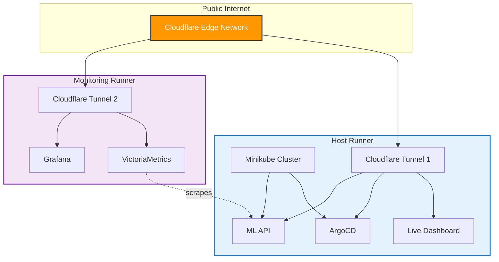
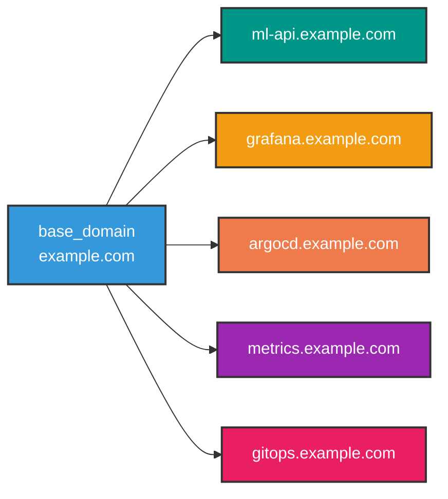
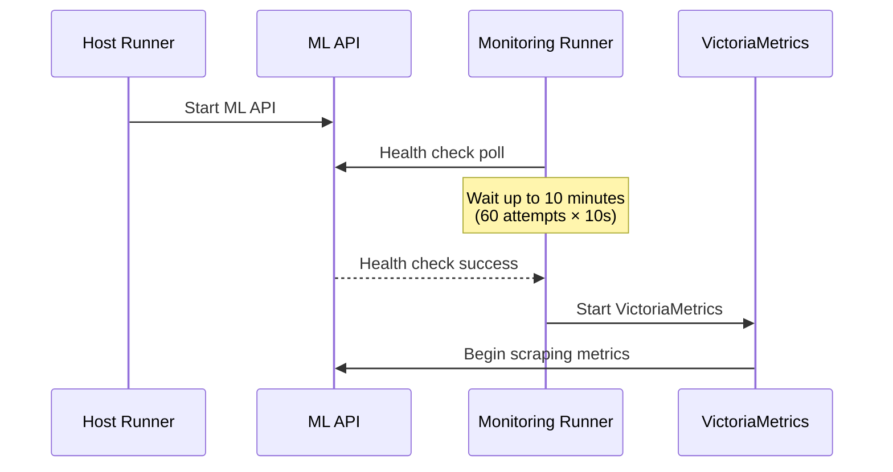

# Modular Infrastructure Architecture

Treating GitHub Actions runners as distributed compute units for scalable infrastructure.

## Concept

| Traditional | Modular Approach |
|-------------|------------------|
| Kubernetes pods | GitHub Actions jobs/runners |
| Manifests | Workflow files |
| Service mesh | Cloudflare Tunnel |
| Orchestrator | GitHub Actions |

Each workflow file defines an independent component that can be:
- Scaled horizontally (multiple runners)
- Deployed independently
- Failed in isolation
- Updated without affecting others

## Current Implementation

Two-component split orchestrated by `live-server.yml`:



## Current Modular Structure

```
.github/workflows/
├── live-server.yml       # Orchestrator (calls both)
├── live-host.yml         # Minikube + ArgoCD + Dashboard
└── live-monitoring.yml   # VictoriaMetrics + Grafana
```

**Benefits achieved:**
- Independent lifecycle management
- Run components separately or together
- Clear ownership per workflow
- Reusable via `workflow_call`

**Usage:**
```bash
# Run everything
gh workflow run live-server.yml -f base_domain=example.com

# Run only host
gh workflow run live-host.yml -f base_domain=example.com

# Run only monitoring
gh workflow run live-monitoring.yml -f base_domain=example.com
```

## Challenges to Solve

### 1. Service Discovery

**Problem:** Runners are isolated. Components need to find each other.

**Current solution:** Convention-based URL derivation from `base_domain` input.



**How it works:**
- User provides single `base_domain` input (e.g., `example.com`)
- All service URLs derived by convention
- Each job displays its service registry at startup
- No runtime discovery needed - URLs are deterministic

**Why this works:**
- Cloudflare hostnames are configured once, don't change
- Convention over configuration reduces errors
- Simple, no external dependencies

**Alternative approaches (for dynamic scenarios):**
- GitHub Actions cache as registry
- External service registry (Redis, Consul)
- GitHub Gist as coordination point
- Cloudflare Workers KV

### 2. Single Tunnel Routing

**Problem:** Multiple runners can't share one tunnel token effectively (Cloudflare load-balances between them by geography, not hostname).

**Current solution:** Separate tunnel per runner (recommended).

**Why separate tunnels work best:**
- Simple, reliable, no coordination needed
- Each runner fully owns its routes
- No race conditions or API complexity
- Minimal overhead (create tunnel in dashboard, add secret)

**Alternative - API-based coordination:**
```
PUT /accounts/{account_id}/cfd_tunnel/{tunnel_id}/configurations
```
Each runner could dynamically register routes via Cloudflare API. However:
- Requires API token with tunnel write permissions
- Creates race conditions (config overwrites)
- Needs fetch-merge-push coordination
- Added complexity not worth it for this use case

**References:**
- [Cloudflare Tunnel Configuration API](https://developers.cloudflare.com/cloudflare-one/connections/connect-networks/get-started/create-remote-tunnel-api/)
- [Tunnel Availability and Failover](https://developers.cloudflare.com/cloudflare-one/networks/connectors/cloudflare-tunnel/configure-tunnels/tunnel-availability/)

### 3. Inter-Runner Communication

**Problem:** Runners have no direct network path to each other.

**Current workaround:** Communicate via public URLs through Cloudflare.

**Potential solutions:**
- Tailscale/WireGuard mesh between runners
- GitHub Actions artifacts for async data sharing
- External message queue (Redis pub/sub)
- Webhook-based coordination

### 4. Dependency Coordination

**Problem:** Some components must start before others (e.g., ML API before monitoring).

**Current solution:** Health check polling before dependent services start.



**How it works:**
- Monitoring runner polls ML API health endpoint
- Waits up to 10 minutes (60 attempts × 10s)
- Proceeds with warning if timeout reached
- Non-blocking: doesn't prevent startup, just delays scraping

**Implementation:**
```bash
while [ $ATTEMPT -lt $MAX_ATTEMPTS ]; do
  if curl -sf -k "$ML_API_URL/health" > /dev/null 2>&1; then
    echo "ML API is ready!"
    break
  fi
  sleep 10
done
```

**Why this works:**
- Simple, no external dependencies
- Graceful degradation (proceeds with warning)
- Parallel jobs remain parallel (no `needs` dependency)

**Alternative approaches:**
- `workflow_run` triggers for strict sequencing
- Coordinator job that orchestrates startup
- GitHub Actions outputs passed between jobs

### 5. State Management

**Problem:** No shared filesystem between runners.

**Potential solutions:**
- GitHub Actions cache for shared state
- External object storage (S3, R2)
- Database for coordination state
- Git repo as state store

### 6. Unified Logging

**Problem:** Logs scattered across multiple workflow runs.

**Potential solutions:**
- Central log aggregation (Loki, CloudWatch)
- GitHub Actions log forwarding
- Shared Grafana with multiple datasources

## Component Constraints

Not all components can be separated:

| Component | Separable? | Reason |
|-----------|------------|--------|
| Minikube | No | Core cluster, others depend on it |
| ArgoCD | No | Must run inside cluster |
| ML API | No | Deployed into cluster by ArgoCD |
| Dashboard | No | Needs kubectl access to cluster |
| VictoriaMetrics | Yes | Standalone, scrapes via HTTP |
| Grafana | Yes | Standalone, queries via HTTP |

## Scaling Patterns

### Horizontal Scaling (Multiple Instances)

```yaml
strategy:
  matrix:
    instance: [1, 2, 3]
```

Good for: Stateless API servers, load testing

### Vertical Scaling (Bigger Runner)

```yaml
runs-on: ubuntu-latest-16-cores
```

Good for: Build jobs, resource-intensive workloads

### Geographic Distribution

```yaml
strategy:
  matrix:
    region: [us-east, eu-west, ap-south]
```

Good for: Multi-region demos, latency testing

## Implementation Priorities

1. ~~**Solve single tunnel routing**~~ - Solved: use separate tunnels per runner
2. ~~**Service discovery mechanism**~~ - Solved: convention-based URL derivation from `base_domain`
3. ~~**Dependency coordination**~~ - Solved: health check polling before dependent services
4. ~~**Split into component workflows**~~ - Solved: `live-host.yml`, `live-monitoring.yml`, orchestrated by `live-server.yml`

## Cost Considerations

- Each parallel job consumes runner minutes independently
- 2 runners for 5.5 hours = 11 runner-hours per session
- Consider consolidating for cost vs splitting for modularity
- GitHub Free: 2,000 minutes/month
- GitHub Pro: 3,000 minutes/month

## References

- [GitHub Actions: Using jobs in a workflow](https://docs.github.com/en/actions/using-jobs)
- [Cloudflare Tunnel: Run as a service](https://developers.cloudflare.com/cloudflare-one/connections/connect-apps/run-tunnel/as-a-service/)
- [GitHub Actions: Caching dependencies](https://docs.github.com/en/actions/using-workflows/caching-dependencies-to-speed-up-workflows)
