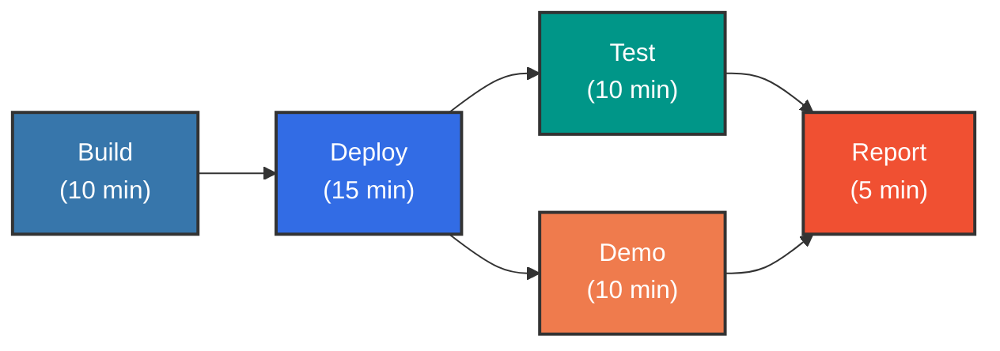
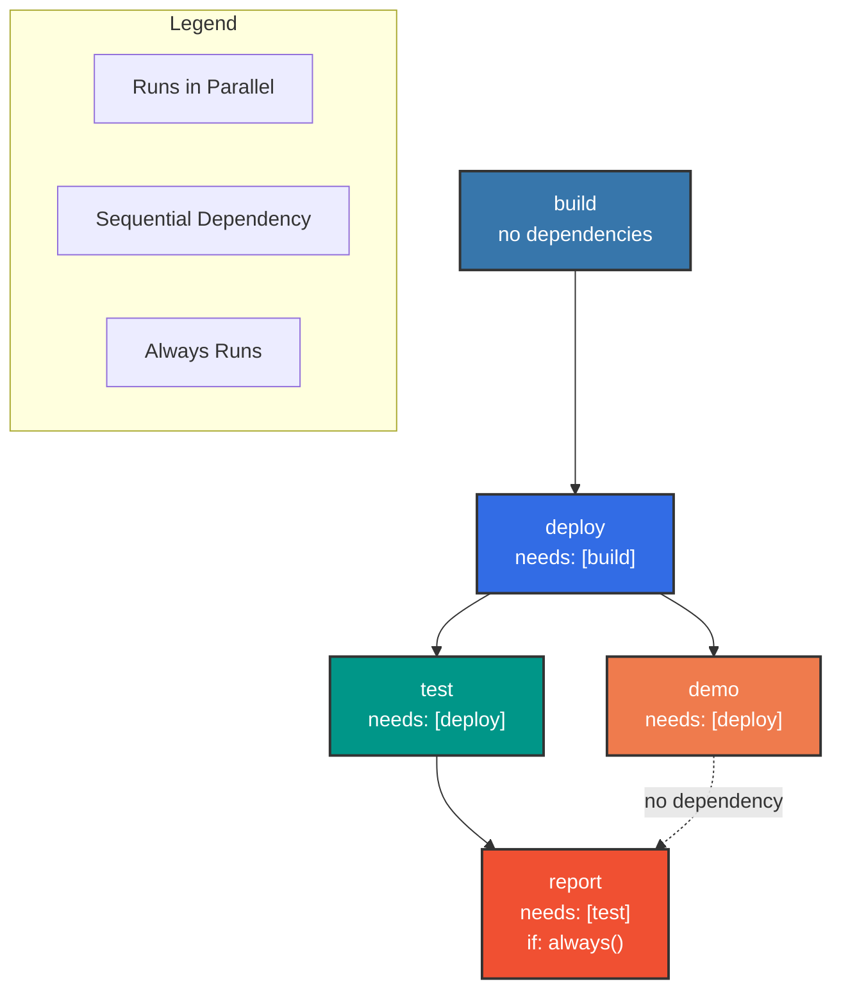
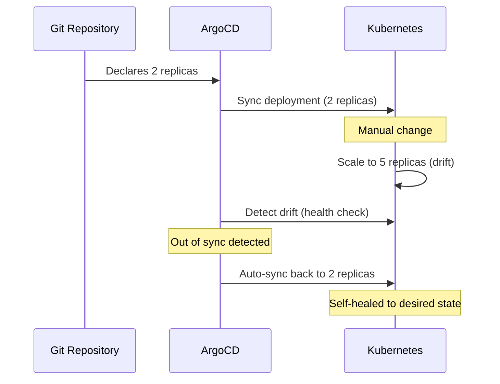
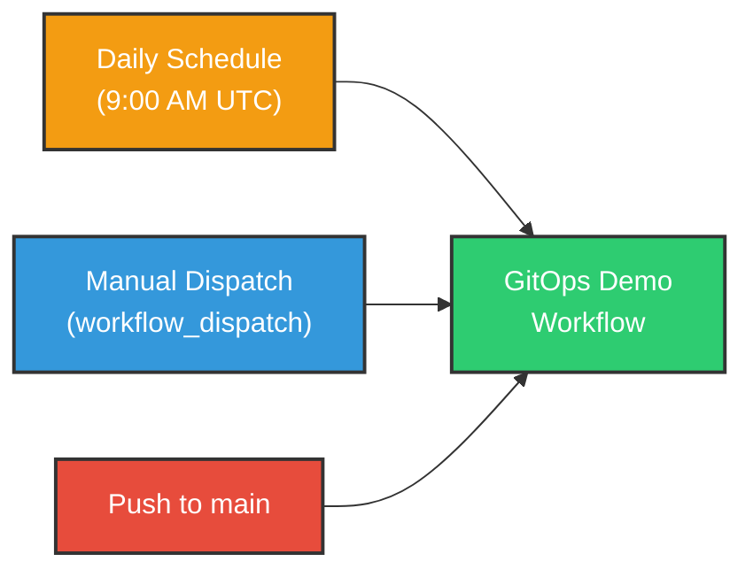

# Workflow Architecture

Parallelized GitHub Actions workflow optimized for efficiency and reliability.

## Pipeline Overview

**Total Duration:** ~15 minutes (vs ~25 minutes sequential)

**Time Savings:** 40% reduction through parallelization

## Job Dependencies

## Jobs

### Build
- Build Docker image with buildx
- Push to GHCR with layer caching
- Output: image tag and digest

### Deploy
- Start Minikube cluster
- Install ArgoCD
- Deploy ML inference and observability via ArgoCD
- Save cluster state artifacts

### Test
- Fresh Minikube cluster
- Deploy and test endpoints: `/health`, `/ready`, `/predict`
- Verify Prometheus metrics
- Upload test results

### Demo
- Fresh Minikube cluster
- Demonstrates GitOps self-healing:
  1. Deploy with 2 replicas
  2. Manually scale to 5 (simulate drift)
  3. ArgoCD detects out-of-sync state
  4. Auto-reverts to 2 replicas (declarative healing)
- Only runs with `demo_mode: full`

**Self-Healing Flow:**

### Report
- Download all artifacts
- Generate comprehensive report
- Comment on PR if applicable
- Runs even if other jobs fail

## Workflow Triggers

- **Schedule**: Daily at 9:00 AM UTC (automated validation)
- **Manual**: workflow_dispatch with demo_mode option
- **Push**: Triggered on push to main branch

## Artifacts

| Job | Artifact | Contents |
|-----|----------|----------|
| Deploy | cluster-state | Kubeconfig, ArgoCD password |
| Test | test-results | Pod status, logs, events |
| Demo | demo-artifacts | ArgoCD state, history |
| Report | final-demo-report | Complete report |
